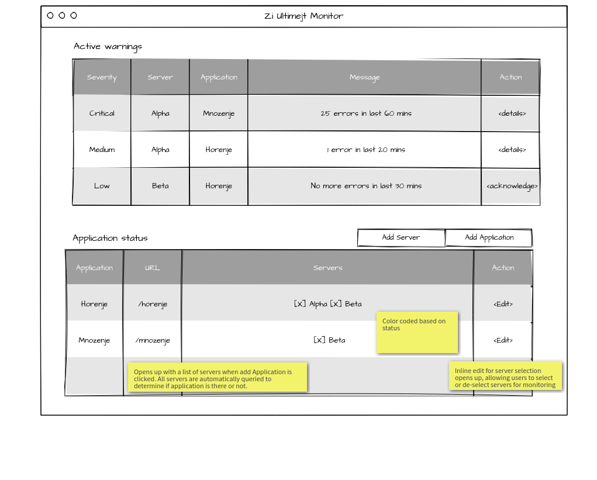

# Naloga 3
## Solution 1
**PRO:** Detects any anomaly in the system and is able to provide detailed report about an issue.

**CON:** It is more complex to implement.

                                                              +-+
                                                              | |
    +------------+         +-----------------------------+    | |
    |            |         |                             |    | |
    |            |         |                             |    | |
    |            +---------+  Application instance 1     |    | |     +---------------------+
    |            |         |                  +----------+    | |     |    Parse, store     |
    |    Load    |         |                  | Catch All+------------>    and notify       |
    |  Balancer  |         +------------------+----------+    |B|  +-->    (load balanced   |
    |            |                     ...                    |A|  |  |    backend)         |
    |            |                                            |R|  |  +----------^----------+
    |            |         +-----------------------------+    |R|  |             |
    |            |         |                             |    |I|  |             |
    |            |         |                             |    |E|  |    +--------+--------+
    |            +---------+  Application instance N     |    |R|  |    |       Apps      |
    |            |         |                 +-----------+    | |  |    |   Desktop, CLI, |
    |            |         |                 |  Catch All+---------+    |   Web, Mobile   |
    +------------+         +-----------------+-----------+    | |       +-----------------+
                                                              | |
                                                              +-+

On each application instance, developer needs to include an async library, which will be sending events to the `Parse, store and notify (PSN) service`. Library is hooked on the global exception handler, similar to the following snippet, where `UnhandledExceptionLogger` is called on unhandled exceptions.

    public static class WebApiConfig
    {
        public static void Register(HttpConfiguration config)
        {
            //Register it here
            config.Services.Replace(typeof(IExceptionLogger), new UnhandledExceptionLogger());

            // Web API routes
            config.MapHttpAttributeRoutes();

            config.Routes.MapHttpRoute(
                name: "DefaultApi",
                routeTemplate: "api/{controller}/{id}",
                defaults: new { id = RouteParameter.Optional }
            );
        }
    }
Other solutions are possible, such as using `ExceptionFilter` or middleware.

Events are always sent out from individual applications, which means they can live in a separate network (e.g. firewalled), while monitoring application is somewhere outside (preferably in company internal network only).

Once events are gathered on the service, they can be analyzed further, determining all sorts of statistics, detecting time windows when errors were occuring and even matching them to individual pull requests.

This way we always get errors on individual URLs users are actually using, and are able to fix bugs even before customers report them.

## Solution 2
**PRO:** Easy to implement

**CON:** Can get false positives or not detect an error at all

Developers need to add a `/health` route to each application to be monitored. This route could return additional information about the application, such as environment type (e.g. development, staging, ...), commit hash, enabled features, enabled integrations, ... It is important that the route responds promptly though!

Monitoring application is a stand-alone application, which can be used inside the network with all applications, since it needs direct access to their URLs.

The following is an example of the minimal configuration the monitoring application needs:

    {
        servers: [
            { name: "alpha", address: "alpha.local" },
            { name: "beta", address: "beta.local" }
        ],
        applications: [
            { name: "Horenje", servers: ["alpha", "beta"], address: "/horenje" },
            { name: "Mnozenje", servers: ["beta"], address: "/mnozenje" }
        ]
    }

